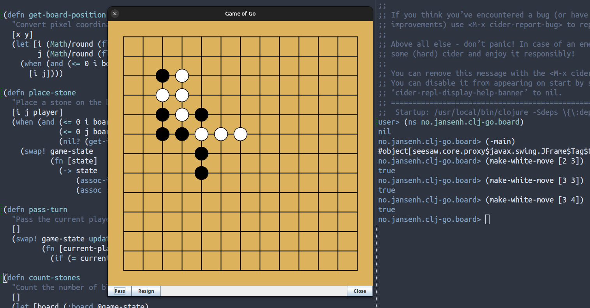

#+title:  README
#+author: Henning Jansen <henning.jansen@jansenh.no>
#+date:   2025-01-28
#+STARTUP: overview

* clj-go

  Go game written in Clojure for the fun of machine learning and
  super non-human intelligence!

  ‼️⚠️🚧 Under Construction - version 0.1.3-SNAPSHOT 🚧️

  #+BEGIN_QUOTE

    You are here. Please enjoy your stay. Reach out if you want to help out?

  #+END_QUOTE

  #+CAPTION: Clj-go in Emacs REPL session
  #+NAME:   clj-go intro
  

** Installation
   Download from https://github.com/Henningzen/clj-go

** Usage
   #+BEGIN_SRC shell
     # Run the project directly, via `:exec-fn`:
     clojure -X:run-x
   #+END_SRC

   The game has no meaning and makes no sense at this time. All we can do is place
   stones on the board, alternating white or black player. Or make a pass on
   a turn. Or resign the game.

   The game-board holds a state and graphical implementation of the game. Logic
   , rules and reasoning to drive the game will follow.

   If you choose to use the project in a REPL, you can interact with the game
   as player white through an API.

   #+BEGIN_SRC clojure
     ;;  navigate to the board namespace
     (ns no.jansenh.clj-go.board)
     ;; start the game
     (-main)
     ;; and interact with the game as player :white
     (make-white-move [1 2])
     (white-pass)
     (white-resign)
     ;; You can observe the game-state in the REPL:
     (deref game-state)
   #+END_SRC

** Testing
   #+BEGIN_SRC shell
     clojure -T:build test
     clojure -X:test
   #+END_SRC

** Source code formatting
   We use [[https://github.com/weavejester/cljfmt][weavejester's cljfmt]] for source code formatting.

   #+BEGIN_SRC shell
     clj -Tcljfmt check
     clj -Tcljfmt fix
   #+END_SRC

** Contribute

*** Commit Message Format

Follow Conventional Commits:
| label       | description                           |
|-------------+---------------------------------------|
| *feat:*     | Add new feature                       |
| *fix:*      | Fix bug                               |
| *docs:*     | Update documentation                  |
| *style:*    | Code style changes (formatting, etc.) |
| *refactor:* | Code refactoring                      |
| *test:*     | Add or update tests                   |
| *chore:*    | Build process, dependencies, etc.     |

## Resources

[Conventional Commits](https://www.conventionalcommits.org/en/v1.0.0/)

* Changelog
  We keep a [[file:CHANGELOG.org][changelog]]!

* License

Copyright © 2025 - 2026 Henning Jansen

This program and the accompanying materials are made available under the
terms of the Eclipse Public License 2.0 which is available at
[[http://www.eclipse.org/legal/epl-2.0][http://www.eclipse.org/legal/epl-2.0]]

This Source Code may also be made available under the following Secondary
Licenses when the conditions for such availability set forth in the Eclipse
Public License, v. 2.0 are satisfied: GNU General Public License as published by
the Free Software Foundation, either version 2 of the License, or (at your
option) any later version, with the GNU Classpath Exception which is available
at https://www.gnu.org/software/classpath/license.html.

** Contact
For any questions or feedback, please contact:

Henning Jansen
henning.jansen@jansenh.no
GitHub: henningzen
